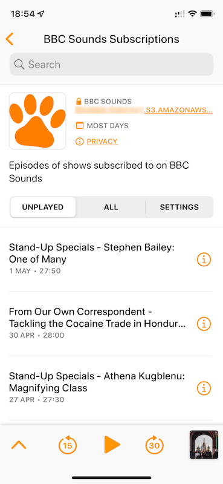

# bobcat
Bobcat allows you to ceate a podcast feed from your BBC Sounds subscriptions.

Bobcat runs in a Docker container and uploads podcast files to an Amazon S3 Bucket.

You can find it [here on Docker Hub](https://hub.docker.com/r/davweb/bobcat).

Here is how the feed looks in Apple Podcasts and Overcast.

 

## How it works
The podcast feed is created as follows:

* A headless Chrome browser is launched.
* The browser logs in to the BBC Website using provided account details.
* A list of episodes is retrieved from the [My Sounds page](https://www.bbc.co.uk/sounds/my).
* The audio for any episodes not already in the S3 bucket are downloaded using [youtube-dl](https://youtube-dl.org), coverted to 128k CBR MP3 files with [ffmpeg](https://ffmpeg.org) and then uploaded to the bucket.
* A `podcast.xml` feed file is created and uploaded.
* Optionally, [Overcast](https://overcast.fm) servers are pinged when the feed changes.

The update process is run when the container is started and then every three hours throughout the day.

The feed will contain the most recent episodes found across all shows. As Bobcat stores episodes it has seen in a SQLite database, entries may remain in the feed after they have been removed from the BBC Sounds website.

The feed contains an `<itunes:block>` element and so should be treated as a private feed by Podcast players.

## Amazon S3 Bucket

Bobcat tidies the S3 bucket it uses, removing any files that are no longer part of the podcast feels.  This means the bucket used by Bobcat should not be used for any other purpose as **any unregonised files will be permanently deleted**.

The account used to access the bucket needs the following permissions:

* `s3:PutObject`
* `s3:GetObject`
* `s3:ListBucket`
* `s3:DeleteObject`
* `s3:PutObjectAcl`

If the bucket used is called `s3-bucket-name` then the podcast feel will be available at `https://s3-bucket-name.s3.amazonaws.com/podcast.xml`.

## Environment Variables

The Environment Varitables used by the Docker container are as follows:

| Variable | Description | Required | Default |
| ------ | ------ | ------ | ------ |
| `BBC_EMAIL` | The email of the BBC account | :white_check_mark: | |
| `BBC_PASSWORD` | The password of the BBC account | :white_check_mark: | |
| `AWS_ACCESS_ID` | The access ID of an AWS account with bucket permissions | :white_check_mark: | |
| `AWS_SECRET_KEY` | The secret key for the AWS account  | :white_check_mark: | |
| `S3_BUCKET_NAME` | The name of the S3 Bucket used to host the podcast  | :white_check_mark: | |
| `EPISODE_LIMIT` | The maximum number of episodes in the fedd | | 20 |
| `LOG_LEVEL` | The log level; one of `DEBUG`, `INFO`, `WARNING` or `CRITICAL` | | `INFO` |
| `LIBRARY_LOG_LEVEL` | The log level for third party code; one of `DEBUG`, `INFO`, `WARNING` or `CRITICAL` | | `CRITICAL` |
| `OVERCAST` | Set to any non-blank value to ping Overcast servers when podcast is updated | | |

## Volumes

The significant volumes in the Docker container are as follows:

| Volume | Description |
| ------ | ------ |
| `/bobcat` | This is where the Bobcat SQLite database is stored which contains episode information.  If the database is lost it can be re-created from the BBC Sounds website but it's better to make the volume persistent if possible. |
| `/tmp` | This is where bobcat downloads and converts files. |

## Logo

If you would like to use a different Logo image for the feed, simply upload your own `logo.png` in to the S3 Bucket.  It will not get overwritten when the feed updates.
